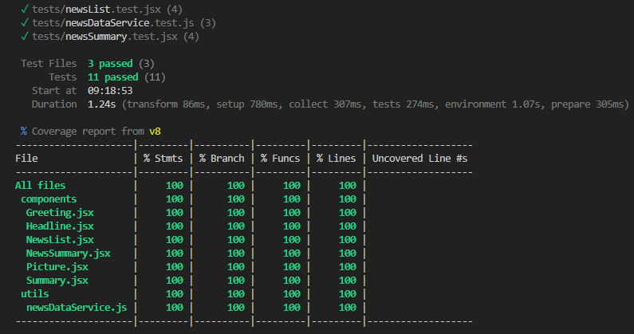

# 📰 **Guardian NewsSnap Hub** 📰

The app's main purpose is to display news headlines and summaries from the Guardian newspaper API.
It allows users to read news at different levels of detail and ensures a responsive and user-friendly cross-device experience.

### **How it works**

#### Fetching Data from Guardian API

The app sends requests to the Guardian API to fetch news data using Axios (for details see src\utils\newsDataService.js and sample data in tests\testData.json).

It uses a specific API endpoint https://content.guardianapis.com/search?order-by=newest&show-fields=byline%2Cthumbnail%2Cheadline%2CbodyText&api-key=cfbd00ae-c12a-49b7-b4c8-be4f1e29b55d to access the news information.

#### Data Display

Once the app receives the data from the API, it processes and displays it on the appropriate pages.

There are two different pages, each offering varying levels of detail for the news you can enjoy and a link to the original article.

##### Headlines page

Get a concise overview of the latest news headlines.


##### Article summary page

Dive deeper with brief summaries of selected news stories.


Access the full article by clicking on a news headline, which redirects you to the original Guardian website.

  

#### Page Navigation

The app uses React Router to handle page navigation. When users click a headline of a specific news, it will lead to a more detailed page.

#### Responsive Design

The app is bootstraped so the users can enjoy a seamless user experience on different devices, including desktops, tablets, and smartphones.

### **How it was developed**

#### Technologies Used

- Frontend: **React**, HTML, CSS, and JavaScript. The app is breakdown into 5 components: NewsList, NewsSummary, Greeting, Headline. Picture, Summary. Each component has a clear responsibility for displaying a specific part or the entire app page.

- API: using the Guardian News API to fetch news data. For details see src\utils\newsDataService.js

- Responsive Design: implementing **Bootstrap** to adapt to different screen sizes and devices.

#### User Stories

```
As a busy politician
So I know what the big stories of the day are
I can see all of today's headlines in one place

As a busy politician
So that I have something nice to look at
I can see a relevant picture to illustrate each news article when I browse headlines

As a busy politician
So that I can get an in depth understanding of a very important story
I can click a news headline to see a summary and a photo of the news article

As a busy politician
So I can get a few more details about an important story
I can see click a news article summary title which links to the original article

As a busy politician
Just in case my laptop breaks
I can read the site comfortably on my phone
```

#### Test-driven

To avoid reaching the limited daily API request rate, a Mock API was created under folder /json-mock-api using a Mock data set in json-mock-api\src\db.json.

This data was used for the whole developing process. To serve the mock data, first invoke the JSON server and serve the data set stored in the db.json file by `json-server --watch src/db.json`. Subsequently, the mock data could be accessed by navigating to http://localhost:3000/response.

Run `npm test -- --coverage` on the test folder, and you will be able to see a coverage report like this:

 

### How to run the App

To run the app locally in development mode, follow these steps:

1.  Clone the repository \
    `git clone https://github.com/your-username/news-summary-challenge.git`

2.  Install **dependencies**\
     `npm init` \
    `npm install`

3.  Open the **project file** in your terminal. Start the **development server**\
    `npm run dev`

4.  Runs the app in the development mode.\
     Open the local path from your terminal (e.g. **http://localhost:5174**) to view it in the browser.

    

    The page will reload if you make edits.\
    You will also see any lint errors in the console.

5.  Open the **tests files** in your terminal. Run
    `npm test` to see test results.

6.  Run `npm run build` to build the app for production to the `build` folder.\
    It correctly bundles React in production mode and optimizes the build for the best performance.

    The build is minified and the filenames include the hashes. Your app is ready to be deployed! See the section about [deployment](https://facebook.github.io/create-react-app/docs/deployment) for more information.

### Acknowledgement

Below is a list of sources that contributed to the development of this app, and I'd like to give credit to.

- [Guardian newspaper API homepage](http://open-platform.theguardian.com/documentation/)
- [SE-2306-A-Demos/08-developing-with-react/05-routing/](https://github.com/digital-futures-academy/SE-2306-A-Demos/tree/main/08-developing-with-react/05-routing)
- [Creating a Mock API in React](https://www.pluralsight.com/guides/react-mock-api)
- [How do I Link to a specific ID?](https://stackoverflow.com/questions/64339014/how-do-i-link-to-a-specific-id)
- [Array.prototype.findIndex()](https://developer.mozilla.org/en-US/docs/Web/JavaScript/Reference/Global_Objects/Array/findIndex)
- [.not.toBeInTheDocument() fails when the element you are matching against isn't in the document](https://github.com/testing-library/jest-dom/issues/202)
- [Make the Header Appear only once For Each Group](https://stackoverflow.com/questions/45898789/react-router-pass-param-to-component)
